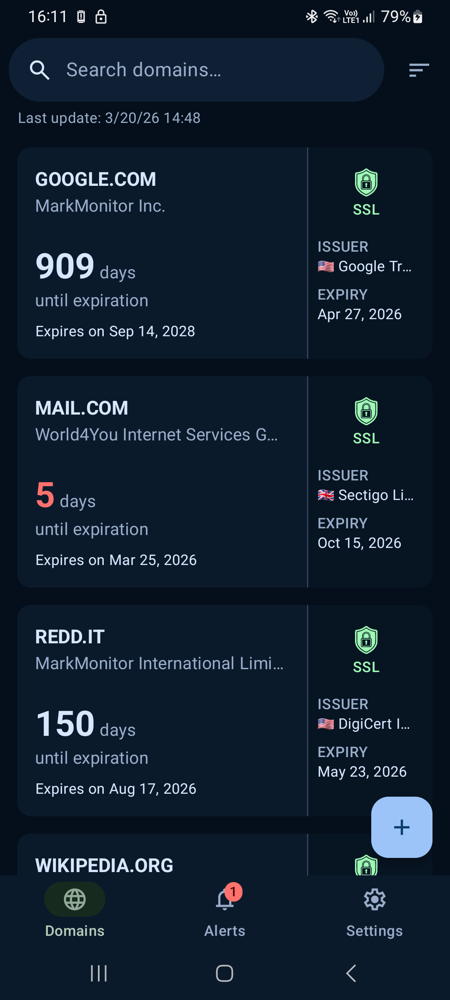
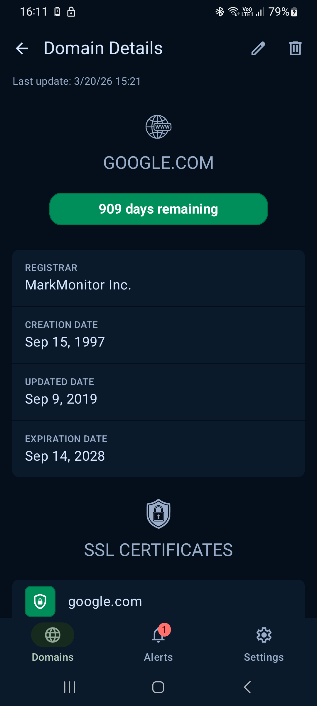
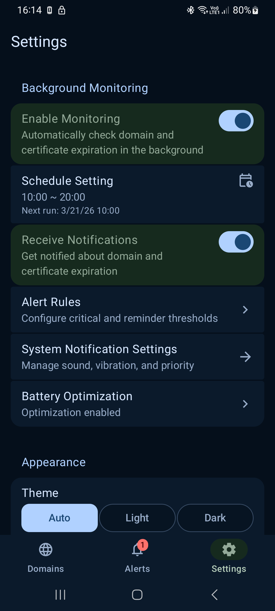

# DomainTrack

[](https://www.android.com/)
[](https://kotlinlang.org/)
[](https://developer.android.com/jetpack/compose)
[](https://m3.material.io/)
[](https://www.apache.org/licenses/LICENSE-2.0)

[](https://play.google.com/store/apps/details?id=me.impa.domaintrack)

**DomainTrack** is a modern Android application for monitoring domain names and SSL certificates. Track expiration dates, receive timely notifications, and ensure your domains and certificates never expire unexpectedly.


---

## Features

- **Domain Management** — Add, edit, and organize your domains in one place
- **SSL Certificate Monitoring** — Track SSL certificate validity and expiration dates
- **Smart Notifications** — Configurable alerts for upcoming expirations
- **Background Sync** — Automatic data updates via WorkManager
- **Modern UI** — Beautiful Material 3 design with dynamic color support
- **Adaptive Layout** — Optimized for phones, tablets, and foldables
- **RDAP/WHOIS Integration** — Accurate domain information from official sources
- **️Customizable Settings** — Personalize notification schedules and thresholds

---

## Screenshots

| Home Screen | Domain Details | Settings |
|:-----------:|:--------------:|:--------:|
|  |  |  |
| *Domain List* | *Domain & SSL Info* | *App Settings* |

---

## Build Instructions

### Prerequisites

- **Android Studio**: Hedgehog (2023.1.1) or newer
- **JDK**: 21 or higher
- **Android SDK**: API level 36
- **Gradle**: 8.x (included via wrapper)

### Clone the Repository

```bash
git clone https://github.com/impalex/domaintrack.git
cd domaintrack
```

### Build Commands

```bash
# Build debug APK
./gradlew assembleDebug

# Build release APK
./gradlew assembleRelease

```

---

## License

This project is licensed under the **Apache License 2.0**.

```
Copyright 2026 Alexander Yaburov

Licensed under the Apache License, Version 2.0 (the "License");
you may not use this file except in compliance with the License.
You may obtain a copy of the License at

    http://www.apache.org/licenses/LICENSE-2.0

Unless required by applicable law or agreed to in writing, software
distributed under the License is distributed on an "AS IS" BASIS,
WITHOUT WARRANTIES OR CONDITIONS OF ANY KIND, either express or implied.
See the License for the specific language governing permissions and
limitations under the License.
```

---

## Author

**Alexander Yaburov**  
© 2026

- GitHub: [@impalex](https://github.com/impalex)
- Package: `me.impa.domaintrack`

---

## Acknowledgments

- [Android Jetpack](https://developer.android.com/jetpack)
- [Jetpack Compose](https://developer.android.com/jetpack/compose)
- [Material Design 3](https://m3.material.io/)
- [Hilt](https://dagger.dev/hilt/)
- [Room Persistence Library](https://developer.android.com/training/data-storage/room)
- [ICANN RDAP](https://www.icann.org/rdap/)

---

## Support

For issues, feature requests, or questions, please:

1. Check existing [Issues](https://github.com/impalex/domaintrack/issues)
2. Create a new issue with detailed description
3. Include logs/screenshots for bugs

---

<div align="center">

**Made with ❤️ using Kotlin & Jetpack Compose**

[⬆ Back to Top](#domaintrack)

</div>
